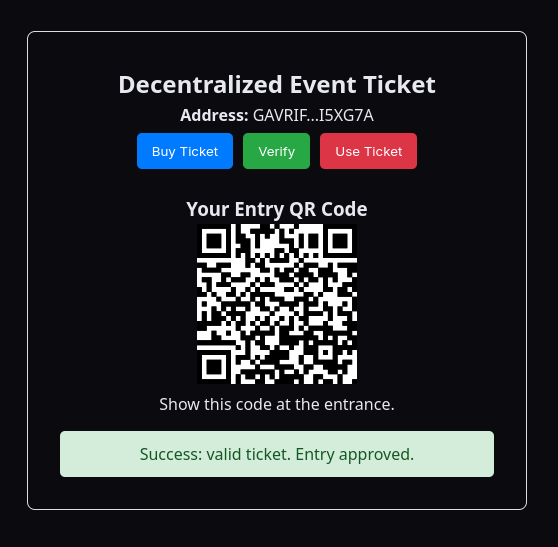

# Stellar Decentralized Ticketing App

A full-stack Stellar Testnet project that connects to the Freighter wallet and interacts with a Soroban smart contract for decentralized event tickets.

The main application lets a user connect a wallet, buy a ticket on-chain, verify whether a wallet owns a valid ticket, display a QR code for entry, and mark a ticket as used through the check-in flow.


## Preview




*The user interface showing a verified ticket and its unique entry QR code.*


## Features

- Freighter wallet connection
- Stellar Testnet network validation
- Soroban smart contract integration
- On-chain ticket purchase
- Ticket verification by wallet address
- QR code display for valid tickets
- Check-in flow that invalidates a used ticket
- Express backend with Stellar account lookup endpoints
- Rust smart contract tests
- React + TypeScript frontend

## Tech Stack

| Layer | Technology |
| --- | --- |
| Frontend | React, TypeScript, Vite |
| Wallet | Freighter API |
| Blockchain SDK | `@stellar/stellar-sdk` |
| Smart Contracts | Rust, Soroban SDK |
| Backend | Node.js, Express |
| Network | Stellar Testnet |

## Project Structure

```text
Stellar-Template/
├── backend/
│   ├── package.json
│   └── server.js
├── contracts/
│   ├── counter/
│   │   ├── Cargo.toml
│   │   └── src/lib.rs
│   └── ticket/
│       ├── Cargo.toml
│       └── src/lib.rs
├── frontend/
│   ├── package.json
│   ├── vite.config.ts
│   └── src/
│       ├── components/TicketApp.tsx
│       ├── lib/stellar.ts
│       ├── lib/ticketContract.ts
│       └── main.tsx
└── README.md
```

## Main Smart Contract

The main contract is located at `contracts/ticket/src/lib.rs`.

| Function | Purpose |
| --- | --- |
| `buy_ticket(buyer)` | Authenticates the buyer and stores a valid ticket for that wallet. |
| `has_ticket(user)` | Returns whether the given wallet currently has a valid ticket. |
| `check_in(admin, user)` | Authenticates the admin wallet and marks the user's ticket as used. |

There is also a secondary counter contract in `contracts/counter/`. It is useful as a simpler Soroban example, but the active frontend currently renders the ticketing application.

## Prerequisites

- Node.js 18 or newer
- npm
- Rust
- Stellar CLI
- Freighter browser extension
- A funded Stellar Testnet wallet

Add the WebAssembly target for Soroban contracts:

```bash
rustup target add wasm32-unknown-unknown
```

## Environment Variables

Create `frontend/.env` and add the deployed ticket contract ID:

```env
VITE_TICKET_CONTRACT_ID=YOUR_DEPLOYED_TICKET_CONTRACT_ID
```

The counter contract variable is only needed if you decide to render or use the counter example:

```env
VITE_COUNTER_CONTRACT_ID=YOUR_DEPLOYED_COUNTER_CONTRACT_ID
```

## Installation

Install frontend dependencies:

```bash
cd frontend
npm install
```

Install backend dependencies:

```bash
cd ../backend
npm install
```

## Running The Project

Start the backend:

```bash
cd backend
npm run dev
```

Start the frontend in another terminal:

```bash
cd frontend
npm run dev
```

Open the app at:

```text
http://localhost:3000
```

Make sure Freighter is set to Stellar Testnet before connecting the wallet.

## Building And Testing

Build the frontend:

```bash
cd frontend
npm run build
```

Check the backend syntax:

```bash
cd backend
node --check server.js
```

Run the ticket contract tests:

```bash
cd contracts/ticket
cargo test
```

Run the counter contract tests:

```bash
cd contracts/counter
cargo test
```

## Deploying The Ticket Contract

Build the ticket contract:

```bash
cd contracts/ticket
stellar contract build
```

Deploy it to Testnet with your configured Stellar CLI identity:

```bash
stellar contract deploy --wasm target/wasm32-unknown-unknown/release/ticket.wasm --source YOUR_IDENTITY --network testnet
```

After deployment, copy the returned contract ID into `frontend/.env` as `VITE_TICKET_CONTRACT_ID`.

## Backend API

### Health Check

```http
GET /api/health
```

Returns backend status, network name, and timestamp.

### Account Lookup

```http
GET /api/account/:address
```

Returns XLM balance, sequence number, subentry count, token balances, and the Stellar Testnet network passphrase for a valid Stellar public address.

## Demo Flow

1. Open Freighter and switch to Testnet.
2. Open `http://localhost:3000`.
3. Connect the wallet.
4. Click `Buy Ticket` and approve the transaction in Freighter.
5. Click `Verify` to confirm that the connected wallet has a valid ticket.
6. Show the generated QR code.
7. Click `Use Ticket` to check in and invalidate the ticket.
8. Verify again to confirm the ticket is no longer valid.

## Verification Status

The latest local verification completed successfully:

- `npm run build` in `frontend`
- `cargo test` in `contracts/ticket`
- `cargo test` in `contracts/counter`
- `node --check server.js` in `backend`

The frontend build currently shows a Vite bundle-size warning because the Stellar SDK is large. This does not block the production build.


## n-Chain Verification

The application is live on the Stellar Testnet. You can verify the smart contract and transactions below:

- **Smart Contract:** [CAKDMHCMUU3GYDZV2NUFXGP6RP3WRHHPXASW2UQY4YJIPCZYYQDYHE47](https://stellar.expert/explorer/testnet/contract/CAKDMHCMUU3GYDZV2NUFXGP6RP3WRHHPXASW2UQY4YJIPCZYYQDYHE47)
- **Sample Transaction (buy_ticket):** [View on Stellar.expert](https://stellar.expert/explorer/testnet/contract/CAKDMHCMUU3GYDZV2NUFXGP6RP3WRHHPXASW2UQY4YJIPCZYYQDYHE47)


## Notes

- This project is configured for Stellar Testnet.
- Never commit real secret keys or private wallet data.
- `.env`, `node_modules`, `dist`, and Rust `target` folders are ignored by Git.
- Testnet XLM has no real financial value and should only be used for development and demos.


